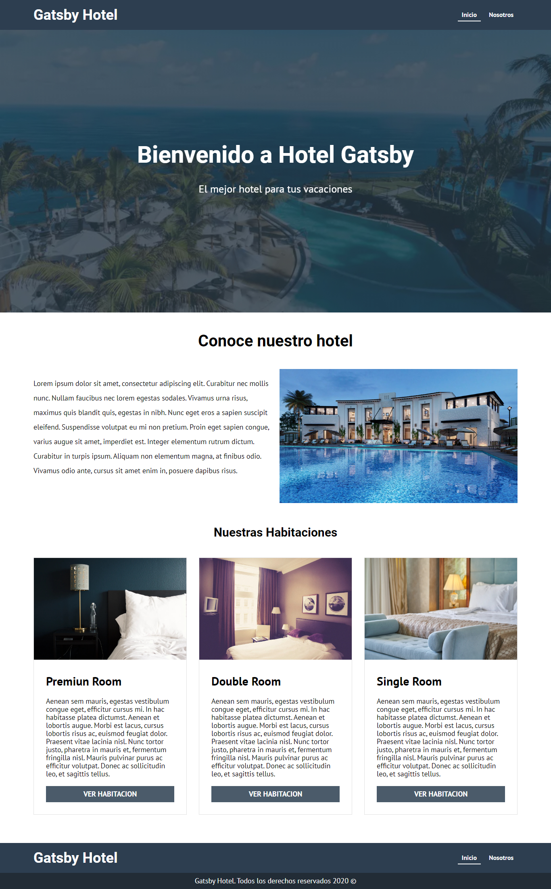

<h1>Gatsby Hotel Application</h1>
<h2>Description</h2>
<p>an application with information about the hotel gatsby</p>
<h2>Languages</h2>
<ul>
  <li>HTML</li>
  <li>CSS</li>
  <li>JS</li>
</ul>
<h2>Tools</h2>
<ul>
  <li>React</li>
  <li>Gatsby</li>
  <li>Hooks</li>
  <li>GraphQL</li>
  <li>DatoCMS</li>
</ul>
<h2>Installation</h2>

```
npm install
```

<h2>Run the project</h2>

```
gatsby develop 
```
<h2>Previews</h2>
Try the live demo https://amazing-edison-fdf58d.netlify.app/


